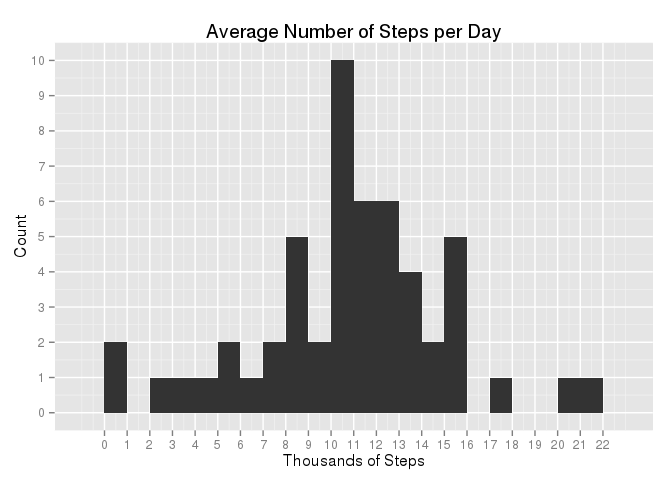
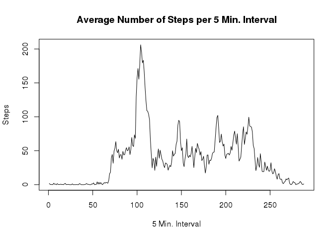
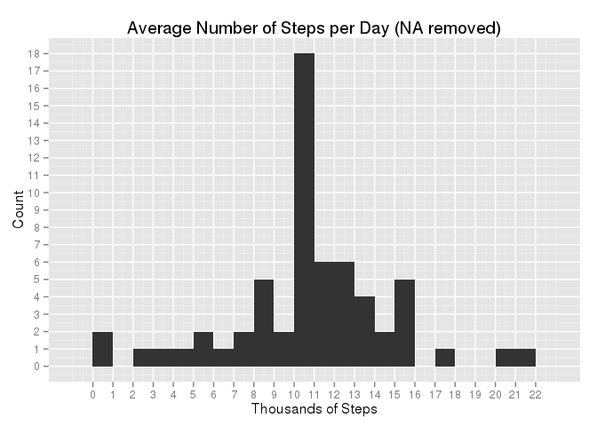
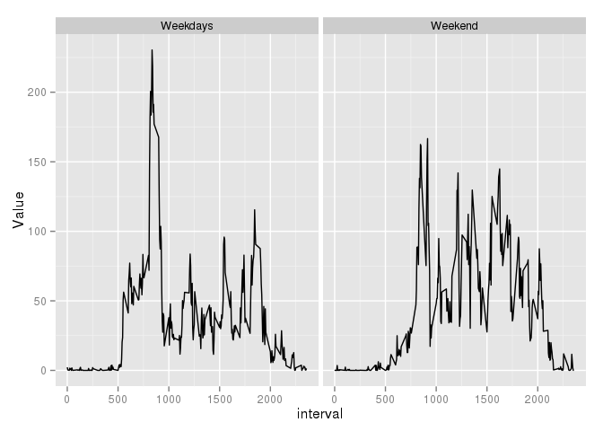

# Reproducible Research: Peer Assessment 1


## Loading and preprocessing the data

The uncompressed dataset is loaded into a dataframe


```r
f <- read.csv(unz("activity.zip","activity.csv"))
```

## What is mean total number of steps taken per day?

The number of steps is computed by using the *tapply()* function, computing the mean across the days in the input dataset.

Then an histogram (using the *ggplot2* library) is created.


```r
library(ggplot2)

x <- tapply(f$steps,f$date,sum)

y <- as.data.frame(x)/1000

gp <- ggplot(data=y,aes(x=y$x))+geom_histogram(binwidth=1)+xlab("Thousands of Steps")+ylab("Count")+ggtitle("Average Number of Steps per Day")+scale_x_continuous(breaks=seq(0,max(y$x,na.rm=T)+1,1))+scale_y_continuous(breaks=seq(0,sum(!is.na(x)),1))

print(gp)
```

 

Finally, we compute the mean and the median of the number of steps per day.


```r
print(sprintf("Average number of steps is %f, median %f",mean(x,na.rm=T),median(x,na.rm=T)))
```

```
## [1] "Average number of steps is 10766.188679, median 10765.000000"
```

## What is the average daily activity pattern?

We compute the mean number of steps across the 288 5Min intervals, by using the *tapply()* function.

The result is used to create a plot.


```r
t <- tapply(f$steps,f$interval,mean,na.rm=T)
plot(t,type="l",main="Average Number of Steps per 5 Min. Interval",ylab="Steps",xlab="5 Min. Interval (288 Daily Samples)")
```

 

Then, we compute the maximum number of (mean) steps.

```r
m <- max(t,na.rm=T)
mi <- as.integer(names(t[which(t %in% m)]))

print(sprintf("Maximum activity (%f steps) is at %d:%d",m,mi%/%100,mi %% 100))
```

```
## [1] "Maximum activity (206.169811 steps) is at 8:35"
```


## Imputing missing values
For now we have just ignored missing values. A new dataset is created by replacing the NAs with the **mean** of steps, for the other days, in the corresponding interval

Then, we compute once again the mean of the number of steps per 5Min interval, also using the *tapply()* function, and plot the result.


```r
f1 <- f

fna <- is.na(f1$steps)
print(sprintf("The original dataset contains %d NAs values",sum(fna)))
```

```
## [1] "The original dataset contains 2304 NAs values"
```

```r
for (i in which(fna)) {
    f1$steps[i]  <-  t[which(names(t)==f1$interval[i])]
}

x1 <- tapply(f1$steps,f1$date,sum)

y1 <- as.data.frame(x1)/1000

gp <- ggplot(data=y1,aes(x=y1$x1))+geom_histogram(binwidth=1)+xlab("Thousands of Steps")+ylab("Count")+ggtitle("Average Number of Steps per Day (NA removed)")+scale_x_continuous(breaks=seq(0,max(y1$x1,na.rm=T)+1,1))+scale_y_continuous(breaks=seq(0,sum(!is.na(x1)),1))

print(gp)
```

 

And we compute the mean and the median of the number of steps per day.


```r
print(sprintf("Average number of steps is %f, median %f",mean(x1),median(x1)))
```

```
## [1] "Average number of steps is 10766.188679, median 10766.188679"
```

By comparing the two plots, it looks like the distribution has not changed much (as expected using the mean values has caused a greater aggregation).

Also *mean* and *median* have not changed significantly.

## Are there differences in activity patterns between weekdays and weekends?

We create a new column (factor) for each day, in order to distinguish weeekdays from weekends. 

This is done by using the *weekdays()* function on the *date* colum, and checking whether the result is *Saturday* or *Sunday*.


```r
library(tidyr)

f1$dayType <- as.factor(ifelse(weekdays(as.Date(f1$date,"%Y-%m-%d"),abbreviate=F) %in% c("Saturday","Sunday"),"Weekend","Weekdays"))
```

Then, using the *tapply()* function, the mean value across intervals and daytypes is computed, generating the final plot.

The pattern for the weekends looks somewhat different from weekdays, starting at a later time and achieving, overall, lower peak values.


```r
f2 <- as.data.frame(tapply(f1$steps,list(f1$interval,f1$dayType),mean))
f2$interval <- as.numeric(rownames(f2))
f3 <- gather(f2,Daytype,Value,-interval)
ggplot(f3,aes(interval,Value))+facet_grid(.~Daytype)+geom_line()
```

 


